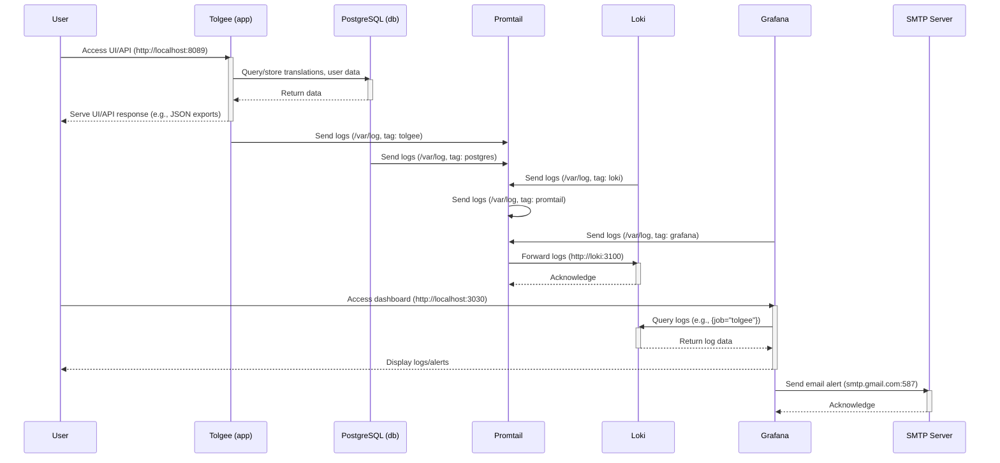

# Containerized-Tolgee
This project builds a self-hosted Tolgee solution.

## Sequence

```mermaid
sequenceDiagram
    participant User
    participant App as Tolgee (app)
    participant DB as PostgreSQL (db)
    participant Promtail
    participant Loki
    participant Grafana
    participant SMTP as SMTP Server

    %% User interacts with Tolgee
    User->>App: Access UI/API (http://localhost:8089)
    activate App
    App->>DB: Query/store translations, user data
    activate DB
    DB-->>App: Return data
    deactivate DB
    App-->>User: Serve UI/API response (e.g., JSON exports)
    deactivate App

    %% Containers generate logs to Promtail
    App->>Promtail: Send logs (/var/log, tag: tolgee)
    DB->>Promtail: Send logs (/var/log, tag: postgres)
    Loki->>Promtail: Send logs (/var/log, tag: loki)
    Promtail->>Promtail: Send logs (/var/log, tag: promtail)
    Grafana->>Promtail: Send logs (/var/log, tag: grafana)

    %% Promtail sends logs to Loki
    Promtail->>Loki: Forward logs (http://loki:3100)
    activate Loki
    Loki-->>Promtail: Acknowledge
    deactivate Loki

    %% User interacts with Grafana
    User->>Grafana: Access dashboard (http://localhost:3030)
    activate Grafana
    Grafana->>Loki: Query logs (e.g., {job="tolgee"})
    activate Loki
    Loki-->>Grafana: Return log data
    deactivate Loki
    Grafana-->>User: Display logs/alerts
    deactivate Grafana

    %% Grafana sends alerts via SMTP
    Grafana->>SMTP: Send email alert (smtp.gmail.com:587)
    activate SMTP
    SMTP-->>Grafana: Acknowledge
    deactivate SMTP
```
